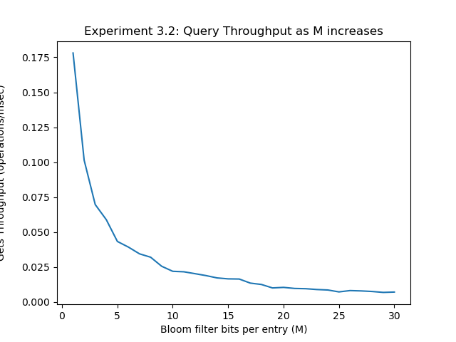

# KV Store Report

Refer to [this page](https://docs.google.com/document/d/1dsIuIzXiIBbiZcNYi1cC62PVE4mF-MdksmIQ1hikFGM) for the official project handout.

# Table of Contents
1. [Introduction](#introduction)
2. [Compilation](#compilation)
    1. [Tests](#tests)
    2. [Playground](#playground)
    3. [Experiments](#experiments)
3. [Project Status](#status)
4. [Database Initialization and Parameters](#init_param)
5. [Implementation Steps](#steps)
    1. [Abstractions](#abstractions)
    2. [Step 1](#step1)
    3. [Step 2](#step2)
    4. [Step 3](#step3)
6. [Testing](#testing)


## Introduction

In this project, we build a key-value store from scratch. A key-value store (KV-store) is a kind of database system that stores key-value pairs and allows retrieval of a value based on its key. KV-stores exhibit the following simple API:

- `Open(“database name”)` opens your database and prepares it to run
- `Put(key, value)` stores a key associated with a value
- `Value = Get(key)` retrieves a value associated with a given key
- `KV-pairs = Scan(Key1, Key2)` retrieves all KV-pairs in a key range in key order (key1 < key2)
- `Close()` closes your database

This API also reflects common data structures (e.g., binary trees). Unlike simple binary trees, however, a KV-store must be able to store data greater than the amount of memory your system has available. In other words, it has to spill data to storage (disk or SSD) as the size of the data grows.

We implement this key-value store using various data structures covered in class. Specifically, we implement an LSM-tree in storage complemented by in-memory Bloom filters. This architecture follows that of many popular modern KV-stores, including RocksDB, Cassandra, HBase, etc.

KV-stores are widely used in industry. Note that they have a far simpler API than traditional relational database systems, which expose SQL as an API to the user. There are many applications for which a simple KV API is sufficient. Note, however, that KV-stores can also be used as the backbone for relational database management systems. For example, MyRocks by Meta is an example of a relational database utilizing as its backbone a key-value store very similar to the one we built, namely RocksDB.

## "I don't care, just tell me how to run it." - Fine... <a name="compilation"></a>

Run `./make.sh` to compile all executables and run the tests in one command. 

### Tests

The test executable file will be located under `/build/kv-store-test` and this file runs all unit tests.

### Playground

We provide an "empty" C++ file with a default version of our database (that you are free modify if you wish - see [Database Initialization and Parameters](#database-initialization-and-parameters)) for you to play with and write any calls to `open`, `put`, `get`, `scan`, print results and verify functionality. The aim is to provide you with an easy way to interact with our database without having to compile a new project. The executable can be found at `/build/kv-store-test` and the file can be changed at `/playground.cpp`.

### Experiments

Run `./experiments.sh` to run the executable that generates all experiments data. You can also generate data individually for each experiment by calling the executable file `/build/kv-store-performance-test` with the parameters indicated on the calls of `experiments.sh`. We also provide a `plot_experiments.sh` script that plots the data generated for each experiment. You can also plot the data of individual experiments by using the same approach.

## Project Status <a name="status"></a> 

TODO: at the end

All experiments plotted below were run on a MacBookAir (13 inch, 2017) with the following specifications:

- **OS**: macOS Monterey Version 12.4
- **Processor:** 1.8 GHz Dual-Core Intel Core i5
- **Memory**: 8 GB 1600 MHz DDR3
- **Graphics:** Intel HD Graphics 6000 1536 MB

## Database Initialization and Parameters <a name="init_param"></a>

We provide the user with a DbOptions object that is used to set default configurations for any database instantiated, and also giving the freedom to specify some options based on the user's preference.

As such, open("database name") is a valid call to create a database if the user simply wants a functioning KV-store without thinking about possible parameters/options, but they may also generate a DbOptions object and pass that in as a second parameter to the call for further customization.

### DbOptions

**Default values**

    - Memtable
        - memTableType: "RedBlackTree"
        - maxMemtableSize: 10 * MEGABYTE

    - SST
        - sstManager: "LSMTreeManager"
        - sstSearch: "BTree"
        - btreeFanout: 100

    - Buffer Pool
        - bufferPoolType: "LRU"
        - bufferPoolMinSize: 1
        - bufferPoolMaxSize: 10

    - Bloom filter
        - filterBitsPerEntry: 10

**Avalable Options**

    - Memtable
        - memTableType: "RedBlackTree"
        - maxMemtableSize: any positive integer multiple of ENTRY_SIZE (representing the maximum number of bytes stored in the memtable)

    - SST
        - sstManager: "BTreeManager", "LSMTreeManager"
        - sstSearch: "BTree", "BinarySearh"
        - btreeFanout: any positive integer value (representing the fanout of the btree)

    - Buffer Pool
        - bufferPoolType: "Clock", "LRU", "None"
        - bufferPoolMinSize: any non-negative integer value (representing the minimum size of buffer pool in MB)
        - bufferPoolMaxSize: any positive integer value (representing the maximum size of buffer pool in MB)

    - Bloom filter
        - filterBitsPerEntry: any non-negative integer value (representing the number of bits per entry in the Bloom filterff)

**Example**

````md
    DbOptions *options = new DbOptions();
    options->setSSTSearch("LSMTree");
    options->setBufferPoolSize(0, 10); // min size, max size
    options->setFilterBitsPerEntry(10);
    options->setMaxMemtableSize(1 * MEGABYTE);
    
    SimpleKVStore db;
    db.open("<db_path>/<db_name>", options);
````
---
## Implementation Steps <a name="steps"></a>

Here we outline the process of implementation the various parts of our system. For simplicity, our simple KV-Store only handles integer keys and integer values.

The general flow is the following: entries get populated in a memtable (fitting entirely in memory) that holds the most recent key-value insertions in the database. Once the memtable grows beyond its capacity, the contents of the memtable are dumped to an SST sorted by the keys.

### Abstractions

Aware of the possible changes to the algorithms as well as our methodology, either as a consequence of efficiency tradeoffs or improvements to the system, we tried to structure our OOP code in a way that maximizes the use of abstractions/interfaces while minimizing the amount of coupling our classes have between each other.

We have a few base interfaces that can be found under the `/include/Base` directory of the project.


### Utility <a name="utility"></a>

- `priority_merge` - This function is a core utility function used throughout our implementation. It allows the neat compaction of various sources of data in order to produce output data which prioritizes the newest data. The function takes in 2 inputs, 1 set of newer data (key-value pairs) and one set of older data. If there is ever an entry which is present in both sources, the function will use the newer version of the key. An example of usage would be when priority merging data from the memtable with data found in SSTs. 

### High-Level OOP Diagram

For better understanding of the codebase and our design decisions, we include here a diagram of our main classes and how they interact with each other:

TODO: image


### Step 1 <a name="step1"></a>

- **Memtable**

We implement a memtable as a balanced binary search tree ([red-black tree](https://en.wikipedia.org/wiki/Red%E2%80%93black_tree) to be precise) supporting standard `put(key,val)`, `get(key)` and `scan(key1, key2)` methods. We also implement an inorder tree traversal that returns all the key-value pairs sorted by their keys, which will be helpful to dump the content into the corresponding SST (refer to next bullet point).

- **SSTs (Sorted String Tables)**

We set a maximum capacity (e.g. a page size of 4KB) to the Memtable, at which point we dump the key-value pairs in sorted order to an SST file `x.sst`. The SSTs are thus stored in decreasing order of longevity where `1.sst` is the oldest Memtable dumped. On a get query that is not found on the current Memtable, our database traverses over the SSTs from newest to oldest to find a key. Note that we implement the SST dump so that it writes in binary to an append-only file to maximize efficiency in sequential writes.

Our initial implementation was quite raw and assumed that a new SST File was made every time a memtable was dumped. This implies that each operation performed on any SST loaded from disk could be performed in memory seeing as they do not grow in size. This assumption is later relaxed as we introduce more complications to our implementation. 

In order to ensure efficiency, we use the `O_DIRECT` flag when opening a file and ensure that all reads are multiples of 512. 

#### Step 1 Experiment <a name="step-1-experiment"></a>

This experiment aims to measure the throughput of the put, get, and scan operations. The methodology is as follows:

For each iteration, we:

1. Randomly sample STEP_SIZE keys and `put` those keys in the db. Time and average throughput for that iteration.
2. Randomly sample NUM_QUERIES keys and `get` those keys from the db. Time and average throughput for that iteration.
3. Randomly sample NUM_QUERIES keys and `get` those keys from the db. Time and average throughput for that iteration.

Note that "randomly" in this case is not uniform. Instead our sample has an intentional skew towards lower valued keys to more closely simulate a real database workload. For each iteration, we sample a key from a value that ranges from 0 to the number of keys inserted up to that point so that the likelihood of querying a key value that is indeed loaded in the database (and not a miss) remains consistent throughout each iteration. Since querying a key not in the database is the most expensive query (as we have to traverse all SSTs), this is an important consideration to make in order to compare the throughput at different sizes.

At each iteration, since we increase the total database size at every step, NUM_QUERIES is calculated from a percentage of all the keys inserted into the database at that point.
 
The graphs are shown below:

<p align="center">
  
</p>

We first notice a huge drop in throughput of gets ans scans after 10MB. This is expected as 10MB is the default size of the memtable and this further displays the strong difference between IO operations and CPU operations as discussed in class. For a better visualization of the trend in different SST insertions as data increases, we plot another version of the graph excluding this initial 10MB drop:

<p align="center">
    
</p>

It is sensible that, as the data size increases, so does the time to return from a query (throughput decreases) as there is more data to look through to find the key. As such, we see this pattern happening precisely in both gets and scans. This is not seen as much in puts, however, because inserts are first bufferd into the memtable and only written out to disk after the memtable is full. 

This is also the reason why puts have much higher throughput (in the order of 100 to 1000 times as high) compared to gets. It is also interesting to see that there are frequent drops in throughput at somewhat regular intervals of time. This should be precisely when the database is dumping the memtable into an SST, which takes signigicantly longer than the other operations.

On a similar note, we also see that scans are significantly slower than gets (also in the order of 100 to 1000 times as high). This is intuitive as scans require iterating over a lot more data items to retrieve all elements that fall within the desired range.

### Step 2 <a name="step2"></a>

- **Buffer Pool**

TODO

- **Eviction Policies**

TODO

- **B-Tree for SST**

In order to execute a BTree correctly, we increased the complexity of our program by now introducing the SSTFileManager class that adds a layer of abstraction and allows the BufferPool to not have to interface directly with any SSTManager. The BTree SST was implemented in stages, the first of which being the exact same as the Append Only SST. In this stage, the data on disk was the exact same but every time an SST was loaded/created, an in-memory BTree was built, allowing Get/Scan calls to query the in memory structure before needing to access disk. 

This in-memory structure was simply a vector of vector of ints. Where each level of the BTree is represented by a vector of ints. Through some simple maths and the knowledge of the fannout (which was stored in the metadata page of each SST), the in-memory structure could be easily used to find the position or lower bound of an element for get or scan calls. 

Slowly, we transitioned to having these in memory structures being written out as "internal node pages" where this data could be parsed from. The data written to disk was exactly the vector of vector of ints, where each vector's end was delimited by an `INT_MAX - 1`. Now, the BTree was only constructed on first creation of the SST (i.e. from memtable to SST dump) and everytime the database was opened thereafter, the BTree was loaded from disk. 

By padding our internal node pages with blank data, we were able to ensure that the start of the leaves was always the start of a new page, this is important for the binary search as it ensures that no complicated processing has to be done to differentiate between internal node data and leaf data which would have different structures. 

After fully implementing the BTree with scans and gets, we then revisited the binary search function and upgraded our old append only file implementation of binary search to now work without needing to load the entire SST into memory. 

At this point, our BTree could function as both a large Append Only File or a BTree through the use of the `useBinary` option. 

_Note: The internal nodes are only read from once, on SST load. While we understand that these nodes should be handled as regular pages and read from disk each time, with sufficiently large fanouts, the number of integers in all internal nodes scales very very very well (log base fannout). This allows us to keep all internal ndoes in memory at all times._ 

#### Step 2 Experiment 1

In this experiment we aim at comparing the throuhgput performance of the Clock vs. LRU buffer pools.

We perform two sub-experiments to display the performance difference in different load scenarios.

1. Clock performing better than LRU

Since Clock provides a smaller CPU overhead, trivially a workload that fits entirely in memory would likely perform better with Clock rather than LRU. However, thinking about a more "realistically" workload that uses the entirety of the database' s storing power, randomly loading and accessing keys in the database should display this difference. The extra overhead associated with LRU should be enough to yield worst performance as this overhead is not useful given that keys are sampled randomly across the database.

TODO: image

**Analysis**

TODO

2. LRU better than Clock:

LRU provides a more accurate representation of the recency of a page at a higher CPU cost. This would then be useful and pay off when the data accesses are skewed and we indeed access a page more often more recently. We then set up
// Access keys in a way that we benefit from the overhead of LRU
// putting the page to the front while clock evicts page earlier
// since it just sets a bit that is already 1 to 1 again (effectively doing nothing).
// For that, we have to access a page once to put it in cache,
// and then access it again fast enough so that the clock did
// not reach said page and changed to 0, while still trying to
// wait as long as possible so that LRU can still keep the page
// while clock evicted on a third access

TODO: image

**Analysis**

TODO

#### Step 2 Experiment 2

This experiment aims at comparing our initial binary search to B-tree search. As such, we load the same randomly sampled keys with a skew like in [Step 1 Experiment](#step-1-experiment) to both databases of comparison. We then time and randomly query about 0.001% of the keys inserted. We plot the graph below:

<p align="center">
  
</p>

We also notice here a the same throughput after 10MB as seen in [Step 1 Experiment](#step-1-experiment) for the same IO vs. CPU reasons as before. 
Additionally, it is interesting to note that for the first few iterations where most operations happen in memory, binary search actually outperforms b-tree search. This is likely because the data is 

For a better visualization of the trend in different SST insertions as data increases, we plot another version of the graph excluding this initial 10MB drop:

<p align="center">
    
</p>


### Step 3 <a name="step3"></a>

- **LSM Tree**

Since our BTree implementation had already been completed in the last step, this step was simply a case of creating a new style of SSTManager, the LSMSSTManager. This class would have to manage the various levels in memory, reconstruct the levels on load of an existing database, and perform compaction when required. 

Thankfully, our BTree implementation already managed to handle varying multiples of the memtable size quite well so no significant changes were required to be made to the BTree implementation. In order to determine the levels, we could simply look at the number of entries in each SST and use logarithms to figure out which level each SST belongs to. 

Finally, the most significant part of the LSM Tree implementation, compaction. In order to facilitate compaction, we first implemented the LSM Tree with an entirely in-memory compaction process. This allowed us to ensure that all other parts of the LSMSSTManager was working correctly. Once this was completed, the algorithm was planned out and implemented as follows:

1. From each of the 2 SSTs being passed in for compaction, we compute the maximum number of possible internal nodes that could be made as a result of compaction (simply by summing the total internal nodes of both SSTs and adding some padding), this allows us to know how many maximum internal node pages we could have.
2. An initial file is created to be appended to as the compaction process completes.
3. A page-by-page priority merge is performed, using 2 buffers 1 for each SST and 2 pointers to track the current position within a page. Once at least one page of data is produced, it is flushed to disk. When a page is about to be written out, we iterate over the page and append to the lowest level of the BTree.
4. With the lowest level of the BTree in memory, we now compute the upper levels and flush the BTree's internal nodes to disk. 
5. The metadata of the file is updated.
6. A new BTreeSST object is loaded and returned by providing the filename of the newly created SST

_Note: When scanning across pages, we do not store data in the buffer pool - this is to prevent sequential flooding_

- **Incorporating Updates and Deletes**

TODO

- **Bloom Filter**

Bloom filter file names are bloom_filter_{level}, where level is the level of the LSM tree for which this bloom filter tracks set membership.
TODO

#### Step 3 Experiment 1

This experiment aims at providing an updated measure of throughput for put, get, and scan operations. More precisely, the database now stores the SSTs in a Log-structured merge-tree (LSM Tree) with a Bloom filter to check for key presence in every level as well a buffer pool to cache hot pages. It then follows precisely the same methodology as [Step 1 Experiment](#Step-1-Experiment), except with fixing the buffer pool size to 10 MB, the Bloom filters to use 5 bits per entry, and the memtable to 1 MB. The throughput is plotted as below:

TODO: image

**Analysis**

TODO

#### Step 3 Experiment 2

In this experiment, we explore how get performance varies as we vary the number of bits per entry used for your Bloom filters. Then, for each value of number of bits per entry being tested, we create a database with the desired number of filter bits and 1MB of memtable, load 128MB worth of data and time the time it takes to query from that database. We plot the throughput graph below:

<p align="center">
  
</p>


## Testing

In our efforts to assure the quality of our code, we relied on unit tests to check individual isolated components, integrated tests to verify that all our components are correctly combined in the flow of the application, as well as a lot of manual testing on playground and on the larger experiments. Some of the unit/integration tests are included in the `src/kv-store-test.cpp` file and we include them here for reference:

- **simple_test:** a basic interaction with a database of putting, getting and updating a few values 
- **hash_test:** a simple test that a the hashing function used is consistent with the same value
- **memtable_puts_and_gets:** checks that memtables correctly stores and retrieves key-value pairs
- **sequential_puts_and_gets:** checks that the db correctly stores sequential keys and retrieves them on get calls
- **sequential_puts_and_scans:** checks that the db correctly stores sequential keys and retrieves them on scan calls
- **random_puts_and_gets:** checks that the db correctly stores random keys and retrieves them on get calls
- **update_keys:** checks that the db correctly updates keys corretly
- **edge_case_values:** checks for edge cases
- **multiple_dbs:** manages multiple dbs opened at once and ensure they are each correctly managed
- **simple_LRU_buffer:**
- **LRU_simple_evict:**
- **LRU_ref_evict:**
- **LRU_grow:**
- **LRU_shrink:**
- **simple_clock_buffer:**
- **clock_simple_evict:**
- **bloom_filter_simple:**

We also run the same tests with multiple database configurations (different search techniques, different buffer options, different sizes of various components) to ensure that the options behave consistenly across the board.


