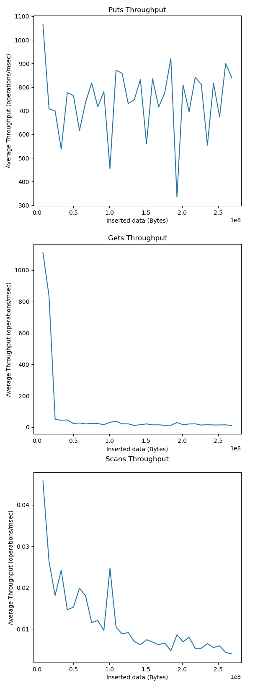
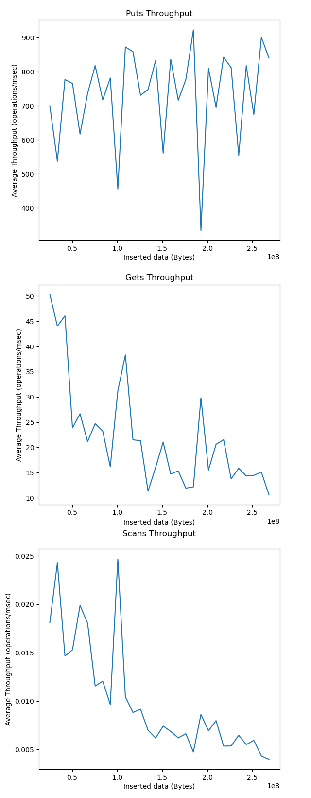

# KV Store Report

Refer to [this page](https://docs.google.com/document/d/1dsIuIzXiIBbiZcNYi1cC62PVE4mF-MdksmIQ1hikFGM) for the official project handout.

# Table of Contents

1. [Introduction](#introduction)
2. [Compilation](#compilation)
   - [Tests](#tests)
   - [Playground](#playground)
   - [Experiments](#experiments)
3. [Project Status](#status)
4. [Database Initialization and Parameters](#init_param)
5. [Implementation Steps](#steps)
   - [Abstractions](#abstractions)
6. [Design Elements](#design-elements)
   - [Get API](#kv-store-get-api)
   - [Put API](#kv-store-put-api)
   - [Scan API](#kv-store-scan-api)
   - [Memtable](#memtable)
   - [SSTs](#ssts-sorted-string-tables)
   - [Database Open & Close](#database-open-and-close-api)
   - [Extendible Hash Buffer Pool](#extendible-hash-buffer-pool)
   - [Integration of Buffer with Get](#integration-of-buffer-with-get)
   - [Shrink](#shrink-api)
   - [Eviction Policies](#eviction-policies)
   - [B-Trees](#b-tree-for-sst)
   - [Bloom Filters](#bloom-filter)
   - [LSM Trees (compaction/merge)](#lsm-tree)
   - [Updates](#updates)
   - [Deletes](#deletes)
7. [Experiments](#experiments-1)
8. [Profiling](#profiling)
9. [Testing](#testing)

## Introduction

In this project, we build a key-value store from scratch. A key-value store (KV-store) is a kind of database system that stores key-value pairs and allows retrieval of a value based on its key. KV-stores exhibit the following simple API:

- `open(“database name”)` opens your database and prepares it to run
- `put(key, value)` stores a key associated with a value
- `delete_key(key)` deletes a key
- `Value = get(key)` retrieves a value associated with a given key
- `KV-pairs = scan(Key1, Key2)` retrieves all KV-pairs in a key range in key order (key1 < key2)
- `close()` closes your database

This API also reflects common data structures (e.g., binary trees). Unlike simple binary trees, however, a KV-store must be able to store data greater than the amount of memory your system has available. In other words, it has to spill data to storage (disk or SSD) as the size of the data grows.

We implement this key-value store using various data structures covered in class. Specifically, we implement an LSM-tree in storage complemented by in-memory Bloom filters. This architecture follows that of many popular modern KV-stores, including RocksDB, Cassandra, HBase, etc.

KV-stores are widely used in industry. Note that they have a far simpler API than traditional relational database systems, which expose SQL as an API to the user. There are many applications for which a simple KV API is sufficient. Note, however, that KV-stores can also be used as the backbone for relational database management systems. For example, MyRocks by Meta is an example of a relational database utilizing as its backbone a key-value store very similar to the one we built, namely RocksDB.

## "I don't care, just tell me how to run it." <a name="compilation"></a>

Run `./make.sh` to compile all executables and run the tests in one command.

### Tests

The test executable file will be located under `/build/kv-store-test` and this file runs all unit tests.

### Playground

We provide an "empty" C++ file with a default version of our database (that you are free modify if you wish - see [Database Initialization and Parameters](#init_param)) for you to play with and write any calls to `open`, `put`, `get`, `scan`, print results and verify functionality. The aim is to provide you with an easy way to interact with our database without having to compile a new project. The executable can be found at `/build/kv-store-test` and the file can be changed at `/playground.cpp`.

### Experiments

Run `./experiments.sh` to run the executable that generates all experiments data. You can also generate data individually for each experiment by calling the executable file `/build/kv-store-performance-test` with the parameters indicated on the calls of `experiments.sh`. We also provide a `plot_experiments.sh` script that plots the data generated for each experiment. You can also plot the data of individual experiments by using the same approach.

Parameters of `/build/kv-store-performance-test`:

    -e [num]: The experiment number to run
    -d [data amount]: The amount of data to run the experiement
    -s [num steps]: The number of operations to time (ex: 1000 means the time is measured every 1000 get operations)

## Project Status <a name="status"></a>

TODO: at the end

All experiments plotted below were run on a MacBookAir (13 inch, 2017) with the following specifications:

- **OS**: macOS Monterey Version 12.4
- **Processor:** 1.8 GHz Dual-Core Intel Core i5
- **Memory**: 8 GB 1600 MHz DDR3
- **Graphics:** Intel HD Graphics 6000 1536 MB

## Database Initialization and Parameters <a name="init_param"></a>

We provide the user with a DbOptions object that is used to set default configurations for any database instantiated, and also giving the freedom to specify some options based on the user's preference.

As such, open("database name") is a valid call to create a database if the user simply wants a functioning KV-store without thinking about possible parameters/options, but they may also generate a DbOptions object and pass that in as a second parameter to the call for further customization.

### DbOptions

**Default values**

    - Memtable
        - memTableType: "RedBlackTree"
        - maxMemtableSize: 10 * MEGABYTE

    - SST
        - sstManager: "LSMTreeManager"
        - sstSearch: "BTree"
        - btreeFanout: 100

    - Buffer Pool
        - bufferPoolType: "LRU"
        - bufferPoolMinSize: 1
        - bufferPoolMaxSize: 10

    - Bloom filter
        - filterBitsPerEntry: 10

**Avalable Options**

    - Memtable
        - memTableType: "RedBlackTree"
        - maxMemtableSize: any positive integer multiple of ENTRY_SIZE (representing the maximum number of bytes stored in the memtable)

    - SST
        - sstManager: "BTreeManager", "LSMTreeManager"
        - sstSearch: "BTree", "BinarySearch"
        - btreeFanout: any positive integer value (representing the fanout of the btree)

    - Buffer Pool
        - bufferPoolType: "Clock", "LRU", "None"
        - bufferPoolMinSize: any non-negative integer value (representing the minimum size of buffer pool in MB)
        - bufferPoolMaxSize: any positive integer value (representing the maximum size of buffer pool in MB)

    - Bloom filter
        - filterBitsPerEntry: any non-negative integer value (representing the number of bits per entry in the Bloom filterff)

**Example**

```md
    DbOptions *options = new DbOptions();
    options->setSSTSearch("LSMTree");
    options->setBufferPoolSize(1, 10); // min size, max size
    options->setFilterBitsPerEntry(10);
    options->setMaxMemtableSize(1 * MEGABYTE);

    SimpleKVStore db;
    db.open("<db_path>/<db_name>", options);
```

---

## Implementation Steps <a name="steps"></a>

Here we outline the process of implementation the various parts of our system. For simplicity, our simple KV-Store only handles integer keys and integer values.

The general flow is the following: entries get populated in a memtable (fitting entirely in memory) that holds the most recent key-value insertions in the database. Once the memtable grows beyond its capacity, the contents of the memtable are dumped to an SST sorted by the keys.

### Abstractions

Aware of the possible changes to the algorithms as well as our methodology, either as a consequence of efficiency tradeoffs or improvements to the system, we tried to structure our OOP code in a way that maximizes the use of abstractions/interfaces while minimizing the amount of coupling our classes have between each other.

We have a few base interfaces that can be found under the `/include/Base` directory of the project.

### Utility <a name="utility"></a>

- `priority_merge` - This function is a core utility function used throughout our implementation. It allows the neat compaction of various sources of data in order to produce output data which prioritizes the newest data. The function takes in 2 inputs, 1 set of newer data (key-value pairs) and one set of older data. If there is ever an entry which is present in both sources, the function will use the newer version of the key. An example of usage would be when priority merging data from the memtable with data found in SSTs.

## Design Elements

### **KV-store get API**

When we perform a get call, we first check the memtable for the presence of the key to see if it was one of the most recently added keys that are stored in memory. If this call fails (not found), we resort to searching through the SSTs to find the key on disk. We implement various ways that this SST search could be done, from plain doing Binary Search starting with the newest SST to oldest SST, to more complicated methods such as with LSM Trees and B-tree searches outlined below.

### **KV-Store put API**

To perform a put operation, the database buffers all keys in the memtable until it reaches capacity. Once that is done, we dump the components to their respective SSTs based on whatever SSTManager is chosen (BTreeSSTManager or LSMTreeSSTManager), see below for more details on those.

### **KV-store scan API**

Scan calls are similar in concept to get calls. They check the memtable and are then handed off to the SSTManagers. They often use the spatial locality to the sorted keys in the SST to reduce the number of operations needed to get an entire chunk of relevant data. We explain in more detail below how exactly these scans are performed.

Scans, by default, do not integrate with the buffer pool. There is an option to do so on the file manager's scan function, which allows inserting and getting a range of pages into the buffer pool with a entry name of the filename appended by the page range. This option is also used to store bloom filter entries in the buffer.

### **Memtable**

We implement a memtable as a balanced binary search tree ([red-black tree](https://en.wikipedia.org/wiki/Red%E2%80%93black_tree) to be precise) supporting standard `put(key,val)`, `get(key)` and `scan(key1, key2)` methods. We also implement an inorder tree traversal that returns all the key-value pairs sorted by their keys, which will be helpful to dump the content into the corresponding SST (refer to next bullet point).

### **SSTs (Sorted String Tables)**

We set a maximum capacity (e.g. a page size of 4KB) to the Memtable, at which point, we dump the key-value pairs in sorted order to an SST file `x.sst`. The SSTs are thus stored in decreasing order of longevity where `1.sst` is the oldest SST dumped. On a get query that is not found on the current memtable, our database traverses over the SSTs from newest to oldest to find a key. Note that we implement the SST dump so that it writes in binary to an append-only file to maximize efficiency in sequential writes.

Our initial implementation was quite raw and assumed that a new SST File was made every time a memtable was dumped. This implies that each operation performed on any SST loaded from disk could be performed in memory seeing as they do not grow in size. This assumption is later relaxed as we introduce more complications to our implementation.

In order to ensure efficiency, we use the `O_DIRECT` flag when opening a file and ensure that all reads are multiples of 512.

### **Database Open and Close API**

To open a new database with default parameters, we call db.open("<db_path>/<db_name>") and this will create a new database at `<db_path>/<db_name>` with the default parameters outlined [here](#init_param). We can additionally create a `DbOptions` object and include that in as a second parameter db.open("<db_path>/<db_name>", options) to create a kv-store with any specific options. Also refer to [this section](#init_param) on how that is done. 

We can also reopen an existing database by passing in the path to where such db was stored.

At the end of your session, you shoud db.close() the database. This call does some book keeping work to ensure the memory contents of the database (i.e. the memtable) is correctly dumped in a way that the db can be reloaded to its normal state. It also frees the memory we allocated during runtime. 

Both of these functions are located in `SimpleKVStore.cpp`.

### **Extendible Hash Buffer Pool**

The buffer pool is implemented using extendable hashing and is located in the `./include/BufferPool` and `./src/BufferPool` directories. The implementation includes a `BufferPool` interface and an abstract class `Directory`, which is responsible for the logic related to extenible hashing. Directory holds a vector of pointers to `BufferPoolEntry` objects, which store data and relevant metadata such as the next and previous entry that are hashed to the same bucket. The entries can hold variable-sized data to accommodate dynamically sized bloom filter data.

To hash the entry name, which is a combination of the file and page number in that file, the buffer pool uses MurmurHash and mods the result by the bit suffix to find the bucket of the entry given the current buffer size. The buffer pool grows the directory by doubling the number of buckets when the buffer pool reaches a certain percentage of the maximum buffer pool size, both values are specified by the user. The new buckets initially point to the bucket that has the same bit suffix, except for the most significant bit. If a bucket points to a bucket that is still a reference to itself, the buffer pool points it to the base bucket to avoid chains. To track all references to a bucket and which bucket a bucket is pointing to, the buffer pool uses two maps, `bucket_num_to_references` and `reference_to`. These references are updated on evictions, shrinking, and inserts.

After doubling the directory size, every bucket is evaluated, and if more than one entry is in a bucket, the buffer pool rehashes every entry in that bucket using the new bit suffix and updates bucket references accordingly. If the user sets a new maximum size smaller than the current maximum size, entries are continually evicted according to the eviction policy until the amount of data in the buffer pool is not larger than the maximum size. Then, the directory itself (number of entries and the bit suffix) is shrunk until at least a minimum percentage (set by the user) of entries are being used.

Note that scans are by default not placed or retrieved from the buffer pool. This is to prevent sequential flooding, and because gets are a stronger signal of hot data.

### **Integration of Buffer with get**

To interact with disk, we use a [file manager](./include/SimpleSSTFileManager.h) as an abstraction. Entries are only placed in the buffer pool on gets. If a get to the buffer pool fails from within the file manager, the page is retrieved from disk and then placed into the buffer pool.

### **Shrink API**

Shrink is implemented in `Directory::shrink()`, in [Directory](./src/BufferPool/Directory.cpp). When the `set_size` is called on the kv-store with a new buffer pool size that is smaller than the current maximum, the maximum is updated. If it is smaller than the current maximum size, entries are continually evicted according to the eviction policy until the amount of data in the buffer pool is not larger than the maximum size. Then, the directory itself (number of entries and the bit suffix) is shrunk until at least a minimum percentage (set by the user, default 25%) of entries are being used.

### **Eviction Policies**

Two eviction policies, `ClockBuffer` and `LRUBuffer`, are implemented as derived classes of `Directory` and located in the `./include/BufferPool` and `./src/BufferPool` directories. The use of inheritance instead of something like a strategy pattern makes the use of eviction-policy-specific metadata easier to handle.

`ClockBuffer` keeps a byte that tracks whether an entry has been used or not since it has been last seen. Every eviction, it searches through all entries (skipping buckets that are references) and decrements the byte if it is one or stops and evicts the page if it is already 0.

`LRUBuffer` uses a corresponding node for each entry. These nodes are kept in a doubly linked list that tracks usage recency. On references to an entry, its corresponding node is moved to the head of the list. On eviction, the node at the tail of the list and its corresponding entry are evicted.

### **B-Tree for SST**

In order to execute a BTree correctly, we increased the complexity of our program by now introducing the SSTFileManager class that adds a layer of abstraction and allows the BufferPool to not have to interface directly with any SSTManager. The BTree SST was implemented in stages, the first of which being the exact same as the Append Only SST. In this stage, the data on disk was the exact same but every time an SST was loaded/created, an in-memory BTree was built, allowing Get/Scan calls to query the in memory structure before needing to access disk.

This in-memory structure was simply a vector of vector of ints. Where each level of the BTree is represented by a vector of ints. Through some simple maths and the knowledge of the fannout (which was stored in the metadata page of each SST), the in-memory structure could be easily used to find the position or lower bound of an element for get or scan calls.

Slowly, we transitioned to having these in memory structures being written out as "internal node pages" where this data could be parsed from. The data written to disk was exactly the vector of ints, where each vector's end was delimited by an `INT_MAX - 1`. Now, the BTree was only constructed on first creation of the SST (i.e. from memtable to SST dump) and everytime the database was opened thereafter, the BTree was loaded from disk.

By padding our internal node pages with blank data, we were able to ensure that the start of the leaves was always the start of a new page, this is important for the binary search as it ensures that no complicated processing has to be done to differentiate between internal node data and leaf data which would have different structures.

After fully implementing the BTree with scans and gets, we then revisited the binary search function and upgraded our old append only file implementation of binary search to now work without needing to load the entire SST into memory.

At this point, our BTree could function as both a large Append Only File or a BTree through the use of the `useBinary` option.

_Note: The internal nodes are only read from once, on SST load. While we understand that these nodes should be handled as regular pages and read from disk each time, with sufficiently large fanouts, the number of integers in all internal nodes scales very very very well (log base fannout). This allows us to keep all internal ndoes in memory at all times._

### **Bloom Filter**

The implementation of bloom filters can be found in src/BloomFilter. Each bloom filter is associated with a specific SST. When an SST is created, its corresponding bloom filter is created from the keys and written to disk.

A bloom filter is composed of a set of seeds that are randomly chosen during its creation, and a bitmap. The seeds are used to pass into murmurhash, which is then used to hash entries for insert and set membership queries.

Serialization and deserialization of bloom filters are supported. To serialize a bloom filter, the number of seeds, each seed, the number of bytes for the bitmap, and each byte of the bitmap are written into a buffer in order. This sequence is then written to disk or to the buffer pool, and can be read in to recreate the same bloom filter when the corresponding SST wants to make a membership query. On disk, the serialized bloom filter is written to the end of its corresponding SST, with metadata stored at the beginning of the SST.

To retrieve these filters, a scan call is made for the pages holding the bloom filter information. Our scan call is handled by a file manager abstraction, and the scan optionally takes in a to_cache parameter (false by default). For bloom filter retrievals, this option is set to true. The result of this query is cached in the buffer pool as a variable size entry. This decision enables the buffer pool to stay agnostic of the type of data it is storing, and it simply holds pages.

### **LSM Tree**

Since our BTree implementation had already been completed in the last step, this step was simply a case of creating a new style of SSTManager, the LSMSSTManager. This class would have to manage the various levels in memory, reconstruct the levels on load of an existing database, and perform compaction when required.

Thankfully, our BTree implementation already managed to handle varying multiples of the memtable size quite well so no significant changes were required to be made to the BTree implementation. In order to determine the levels, we could simply look at the number of entries in each SST and use logarithms to figure out which level each SST belongs to.

Finally, the most significant part of the LSM Tree implementation, compaction. In order to facilitate compaction, we first implemented the LSM Tree with an entirely in-memory compaction process. This allowed us to ensure that all other parts of the LSMSSTManager was working correctly. Once this was completed, the algorithm was planned out and implemented as follows:

1. From each of the 2 SSTs being passed in for compaction, we compute the maximum number of possible internal nodes that could be made as a result of compaction (simply by summing the total internal nodes of both SSTs and adding some padding), this allows us to know how many maximum internal node pages we could have.
2. An initial file is created to be appended to as the compaction process completes.
3. A page-by-page priority merge is performed, using 2 buffers 1 for each SST and 2 pointers to track the current position within a page. Once at least one page of data is produced, it is flushed to disk. When a page is about to be written out, we iterate over the page and append to the lowest level of the BTree.
4. With the lowest level of the BTree in memory, we now compute the upper levels and flush the BTree's internal nodes to disk.
5. The metadata of the file is updated.
6. A new BTreeSST object is loaded and returned by providing the filename of the newly created SST

_Note: When scanning across pages, we do not store data in the buffer pool - this is to prevent sequential flooding_

### **Updates**

Updates can be called by simply calling a `put` with an existing key. No special processing is required. 

Updates are not in-place in order to ensure performance as discussed in lectures. When issuing an update, if an entry is already present in the memtable, the RedBlackTree will simply update the value associated with the given key. 

When issuing a get call, we know that data is accessed in order of time, i.e. most recent entries are accessed first. As a result, the most recent value associated with a key will always be returned. This applies to SSTs as we scan SSTs from latest to oldest. 

When issuing a scan call, we rely on the aforementioned `priority_merge` function to ensure that if there is a key conflict, only the latest version of the key is persisted. 


### **Deletes**

Deletes can be called using `delete_key` which returns false if the key is not already present in the database. If the key is present in the database, a tombstone is added with the key being the key to be deleted and the value being `INT_MIN`. 

When we now issue a `get`, if the value at the end of the get call is `INT_MIN` the function now returns false. And similarly to updates, due to how we access data temporally, we can ensure that if the most recent update to a key is a delete, the get call will return false. 

For scans, `priority_merge` has a speical situation which ensures that if 2 keys are equal in the master and older data, neither key is persisted in the resulting data. Since we always know that the key has to be present in the data before issuing a delete, at some point, the older data (with the old value of the key) will get priority merged with the new tombstone. LSMTree compaction also performs a similar operation, eventually removing the tombstone and freeing space. 

## Experiments

#### Step 1 Experiment <a name="step-1-experiment"></a>

This experiment aims to measure the throughput of the put, get, and scan operations. The methodology is as follows:

For each iteration, we:

1. Randomly sample STEP_SIZE keys and `put` those keys in the db. Time and average throughput for that iteration.
2. Randomly sample NUM_QUERIES keys and `get` those keys from the db. Time and average throughput for that iteration.
3. Randomly sample NUM_QUERIES keys and `scans` those keys from the db. Time and average throughput for that iteration.

Note that "randomly" in this case is not uniform. Instead our sample has an intentional skew towards lower valued keys to more closely simulate a real database workload. For each iteration, we sample a key from a value that ranges from 0 to the number of keys inserted up to that point so that the likelihood of querying a key value that is indeed loaded in the database (and not a miss) remains consistent throughout each iteration. Since querying a key not in the database is the most expensive query (as we have to traverse all SSTs), this is an important consideration to make in order to compare the throughput at different sizes.

At each iteration, since we increase the total database size at every step, NUM_QUERIES is calculated from a percentage of all the keys inserted into the database at that point.
 
The graphs are shown below:

<p align="center">
  
</p>

We first notice a huge drop in throughput of gets ans scans after 10MB. This is expected as 10MB is the default size of the memtable and this further displays the strong difference between IO operations and CPU operations as discussed in class. For a better visualization of the trend with regards to SST operations as data increases, we plot another version of the graph excluding this initial 10MB drop:

<p align="center">
    
</p>

It is sensible that, as the data size increases, so does the time to finish a query operation (causing throughput to decrease) as there is likely more data to look through to find the key. As such, we see this pattern happening precisely in both gets and scans. Query throghput is, however, dependent on how likley it is that we find this data in a a recently dumped SST. Thus we expect to see a general downwards trend in throughput, yet it also expected to vary when the keys are "easier" to find. This is observed in the graph by a few spikes in both the get and scan plots. 

This general downwards pattern is not seen as much in puts, however, because inserts are first bufferd into the memtable and only written out to disk after the memtable is full. In addition, the memtable dump does not depends on the nuber of items inserted in the database since we write SSTs in order of recency to files on disk.

This is also the reason why puts have much higher throughput (in the order of 10 to 100 times as high) compared to gets. It is also interesting to see that there are frequent drops in throughput at regular intervals of time. This should be precisely when the database is dumping the memtable into an SST, which takes significantly longer than the other operations due to IO overheads.

On a similar note, we also see that scans are significantly slower than gets (in the order of 100 to 1000 times as high). This is intuitive as scans retrieve more data and require iterating over a lot more data items to retrieve all elements that fall within the desired range.


#### Step 2 Experiment 1

In this experiment we aim at comparing the throuhgput performance of the Clock vs. LRU buffer pools.

We perform two sub-experiments to display the performance difference in different load scenarios. For both experiments, we make sure that the keys we are inserting and querying are consistent on both databases so that the experiment is a valid comparison. In other words, we insert the same keys and also query consistent keys in the same order so that the databases are beind compared under exactly the same load.

1. **Clock performing better than LRU**

    Since Clock provides a smaller CPU overhead, trivially a workload that fits entirely in memory would likely perform better with Clock rather than LRU. However, thinking about a more "realistically" workload that uses the entirety of the database's storing power, uniformly and randomly loading as well as uniformly and randomly accessing keys in the database should display this difference. The extra overhead associated with LRU should be enough to yield worst performance as this overhead is not useful given that keys are sampled randomly across the database.

2. **LRU better than Clock**

    LRU provides a more accurate representation of the recency of a page at a higher CPU cost. This would then be useful and pay off when the data accesses are skewed and we indeed access a page that was recently used more often. Therefore, we perform the same experiment as before, except we sample the keys from a skewed distribution that favours lower valued keys.
    
Both experiments are plotted below:
    
<p align="center">
   
</p>
  
As expected, Clock slightly outperfermos LRU in most iterations of the first graph and LRU slightly outperforms Clock in most iterations in the second graph. It is also interesting to note, that as the buffer size increases, we do not see a signifcant increase in throughput. This is likely because our buffer pool is large enough to begin (at least 1 MB) to fit most of our queries in. To see this increase more explicitly, we might need to perform a much bigger volume of queries or significantly reduce the size magnitude of the buffer pool. 


#### Step 2 Experiment 2

This experiment aims at comparing our initial binary search to B-tree search. As such, we load the same randomly sampled keys with a skew like in [Step 1 Experiment](#step-1-experiment) to both databases of comparison. We then time and randomly query about 0.001% of the keys inserted. For both experiments, we make sure that the keys we are inserting and querying are consistent on both databases so that the experiment is a valid comparison. In other words, we insert the same keys and also query consistent keys in the same order so that the databases are beind compared under exactly the same load. Finally, we also choose not to have any buffer pools interfering with our search so as to leave all the queries going through the SSTs, and we also set SSTManager to LSMTreeManager so that SSTs are larger in size and the the discrepancy is shown more aggresively between the two methods.


We plot the graph below excluding the initial throughput drop seen in [Step 1 Experiment](#step-1-experiment) due to the memtable IO vs. CPU difference:

<p align="center">
  
</p>

We see that BTree outperforms the binary search as expected. This is as discussed in class, as the size grows, the amount of data increases and `log_f(N) << log_2(N)` where `f = 100`. Additionally, our BTree internal nodes are always in memory, so it makes sense that much less I/O is performed per get query. 

Finally, we notice some spikes in the data, this is because we generate a new set of queries (the same set is used for both BTree and Binary Search) for each data point. This means that some datapoints may get queries which have more data in the memtable. Nonetheless, the spikes are consistent across both the BTree and Binary Search, implying a systematic error. 


#### Step 3 Experiment 1

This experiment aims at providing an updated measure of throughput for put, get, and scan operations. More precisely, the database now stores the SSTs in a Log-structured merge-tree (LSM Tree) with a Bloom filter to check for key presence in every level as well a buffer pool to cache hot pages. It then follows precisely the same methodology as [Step 1 Experiment](#Step-1-Experiment), except that it additionally fixes the buffer pool to type Clock and size of 10 MB, the Bloom filters to use 5 bits per entry, and the memtable to 1 MB. The throughput is plotted as below:

<p align="center">
  
</p>

Here, again, we notice similar patterns with get and scan calls in a downward throughput trend. 

We also realize that the throughput on this experiment is much slower compared to the one in step 1. We reason that this is likely a consequence of our random workload choice for our experiments. All the components we added since step 1 (LSM Trees, Buffer Pools and Bloom Filters) are geared towards improving sequential access or skewed key access, and we think that the overhead they create are not worth the improvements they bring in a randomly accessed load as it was done in this experiment. As such, this overhead actually brings down our throughput with no gains in performance as seen in the graphs.

More precisely, the Buffer Pool is adding an extra "unnecessary" check as the random key will likely not be in one its pages. The LSM Tree is, most times, making it so that the key is in its last level and is searched through every level before finding it. The Bloom filter will not help much either as a key in the last level will cause an extra check for every level.

#### Step 3 Experiment 2

In this experiment, we explore how get performance varies as we vary the number of bits per entry used for your Bloom filters. Then, for each value of number of bits per entry being tested, we create a database with the desired number of filter bits and 1MB of memtable, load 256 MB worth of data and time the time it takes to query from that database. For all experiments, we make sure that the keys we are inserting and querying are consistent across databases so that the experiment is a valid comparison. In other words, we insert the same keys and also query consistent keys in the same order so that the databases are beind compared under exactly the same load. In addition, we allocate a big enough buffer pool to guarantee that all our bloom filters fit in memory and do not add to I/O overheads.

We plot the throughput graph below:

<p align="center">
  
</p>

Contrary to our initial expectations, the query throughput decreases gradually as more bits are allocated to the bloom filter. We believe that this indicates the overhead of managing a larger bitmap is worse for performance than the benefit gained from the lower false positive rate of using additional bits. Since the bitmap is often being serialized and deserialized as a bloom filter is recreated for each query, additional bits make these operations even more expensive. Meanwhile, we noticed that even with 10 bits our false positive rate was quite low, so we likely saving very few I/Os by adding more bits.

## Profiling
### Improving Get Calls
#### Raw Data vs Vectors
When initially running the experiments for step 2 and 3, we used the CLion's profiler to get a call graph and visualize what was contributing to our runtimes. Originally, our get calls relied on a function `get_page` which can be seen in the BTreeSST. This function converts raw data read from disk into a vector so that operations performed could be much more simple and readable. The profiler made it clear that vector operations were a significant contribution as even if we were examining one or 2 values in the page, we would have had to iterate over the entire page. As a result, we created a `get_page_raw` function which simply returns an array of ints directly read from disk. This **significantly** improved runtime and we had to modify some functions to now operate on raw data instead of vectors. 

#### The case of the ampersand
After making the optimization noted above, we noticed that our BTree search was much slower than the binary search. Once again, the profiler came to the rescue. It was notable that most of the runtime of the `btree_find` function, a function that takes in a BTree and returns the leaf starting position, was coming from `~vector`, the vector destructor. Now, a simple inspection of the `btree_find` function can show that no vectors are being constructed nor destructed, implying that this is something unexpected in the call graph. As hinted to by the title, it was because we were passing in the BTree into the `btree_find` function which was making a temporary copy of the entire vector, and hence, ruining performance. By changing the type of the parameter to `const &`, we made it a constant reference, increasing our performance by orders of magnitude. 

### Bloom Filter Performance

Through profiling, we noticed that for some of our experiments, the bloom filter deserialization was taking a signficant portion of our runtime. This prompted us to switch from using a vector for the bitmap to an array, so that we can directly use the page data retrieved by the file manager. As you can see from the profile screenshots below, this decreased the performance impact of bloom filters signficantly, going from taking ~35% of our runtime to ~3.4%.

<p align="center">
  
  
</p>

## Testing

In our efforts to assure the quality of our code, we relied on unit tests to check individual isolated components, integrated tests to verify that all our components are correctly combined in the flow of the application, as well as a lot of manual testing on playground and on the larger experiments. Some of the unit/integration tests are included in the `src/kv-store-test.cpp` file and we include them here for reference:

- **simple_test:** a basic interaction with a database of putting, getting and updating a few values
- **hash_test:** a simple test that checks if the hashing function used is consistent with the same value
- **memtable_puts_and_gets:** checks that memtables correctly stores and retrieves key-value pairs
- **sequential_puts_and_gets:** checks that the db correctly stores sequential keys and retrieves them on get calls
- **sequential_puts_and_scans:** checks that the db correctly stores sequential keys and retrieves them on scan calls
- **random_puts_and_gets:** checks that the db correctly stores random keys and retrieves them on get calls
- **update_keys:** checks that the db correctly updates keys correctly
- **delete_keys:** checks that the db correctly delete keys correctly while maintaining undeleted keys intact.
- **edge_case_values:** checks for edge cases
- **multiple_dbs:** manages multiple dbs opened at once and ensure they are each correctly managed
- **simple_LRU_buffer:** verifies that the database still works as expected when integrating with LRU buffer, without evictions
- **LRU_simple_evict:** verifies that the first inserted value (least recent) gets evicted when no references are made
- **LRU_ref_evict:** verifies that referecing a value updates its recency by checking that a recently referenced value does not get evicted first
- **buffer_grow:** test that a buffer can grow directory size and still support puts and gets as expected
- **buffer_shrink:** test that a buffer can shrink directory size and still support puts and gets as expected
- **simple_clock_buffer:** verifies that the database still works as expected when integrating with clock buffer, without evictions
- **clock_simple_evict:** verifies that a inserted value gets evicted when no references are made
- **bloom_filter_simple:** check that querying a missing value on a new bloom filter is false, and that querying after inserting returns true

We also run the same tests with multiple database configurations (different search techniques, different buffer options, different sizes of various components) to ensure that the options behave consistenly across the board. We also run various sizes of the experiments as stress/load tests of our databases.
